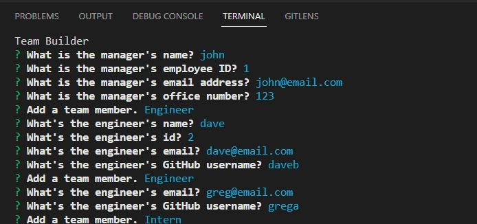

# Module10Challenge_TEAM_Profiler

## Description

Bootcamp: Module 10 Challenge  
Object-Oriented Programming Challenge: Team Profile Generator  
Codebase correction that follows accessibility standards so that the site is optimized for search engines
Uses Inquirer@8.2.4 - https://www.npmjs.com/package/inquirer/v/8.2.4
Uses Jest@29.3.1 - https://www.npmjs.com/package/jest

## Table of Contents (Optional)

N/A

## Installation

open integrated terminal for index.js and run 'npm i'

## Usage
Screenshot of readme creation

Video of readme creation
[Video Demo](https://drive.google.com/file/d/1EftTXZKHgQRk72LBOFucOcD_4nnNsrFJ/view)

## Credits

Ideas of outputs taken from:
mmeii - Dec 2020
https://github.com/mmeii/team-profile-generator

sylviaprabudy - July 2020
https://github.com/sylviaprabudy/team-profile-generator

## License

Please refer to the LICENSE in the repo.
